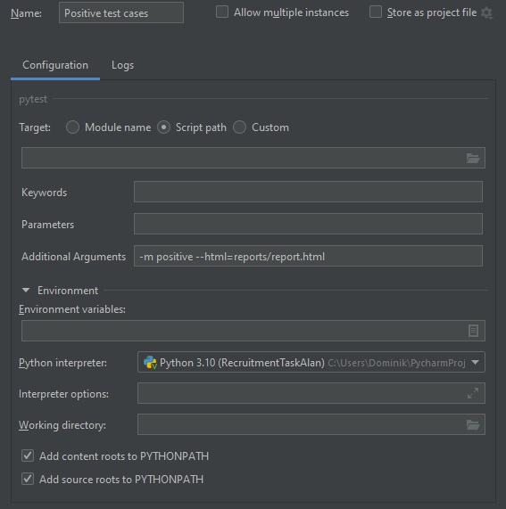
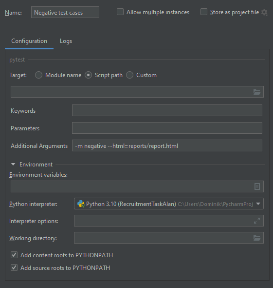
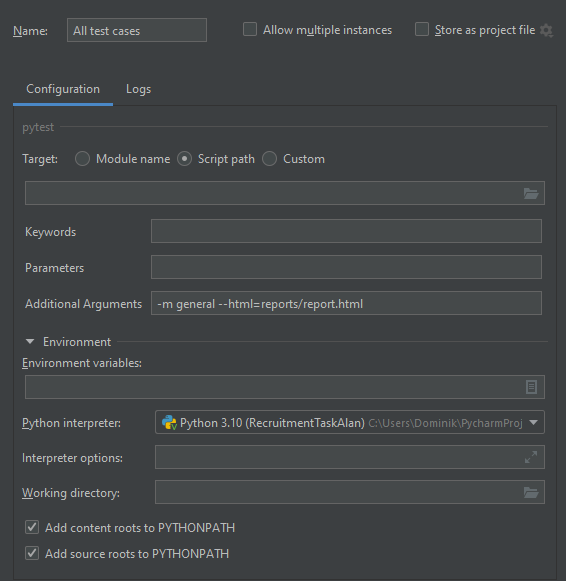
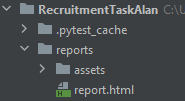
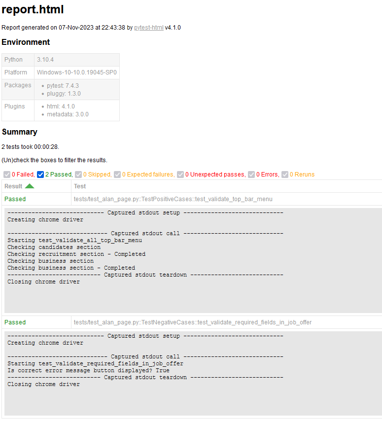
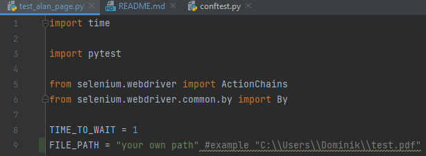

## General info
Automation tests created for recruitment purposes, created by Dominik Majchrzak.

## Setup - Automation tests

To run this project:

* Run Git Bash.
* Choose the project location in Git Bash.
* Type $ git clone https://github.com/haglazpl/Automation-tests
* Press enter.
* Now run IntelliJ PyCharm.
* Open the project location in File Tab.
* If you want to run happy path tests then edit configuration like this:

* If you want to run negative path tests then:

* If you want to run all tests then:

* To check test html report go to reports folder:

## IMPORTANT
* before executing **test_validate_required_fields_in_job_offer**, user needs to set up his own user path to test.pdf file.

